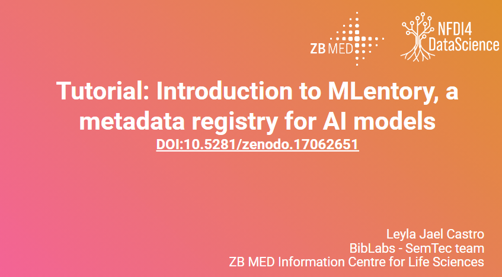

<h1>Introduction to MLentory</h1>

If you want to cite this tutorial:

Castro, L. J. (2025, September 15). Tutorial: Introduction to MLentory, a metadata registry for AI models. 48th German Conference on Artificial Intelligence (KI2025), Postdam, Cologne. Zenodo. https://doi.org/10.5281/zenodo.17062651 

<table align="center" style="width:100%">
  <tr>
  <td><a href="https://www.zbmed.de/en/legal-notice" target="_blank">Legal notice</a></td>
  <td><a href="https://www.zbmed.de/en/disclaimer" target="_blank">Disclaimer</a></td>
  <td><a href="https://www.zbmed.de/en/privacy-policy" target="_blank">Privacy policy</a></td>
  </tr>
</table> 